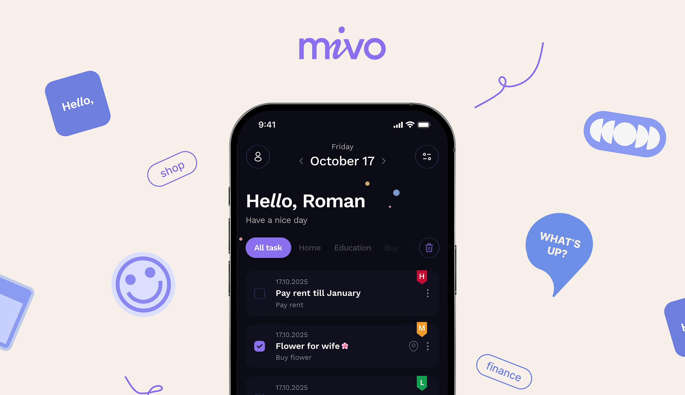
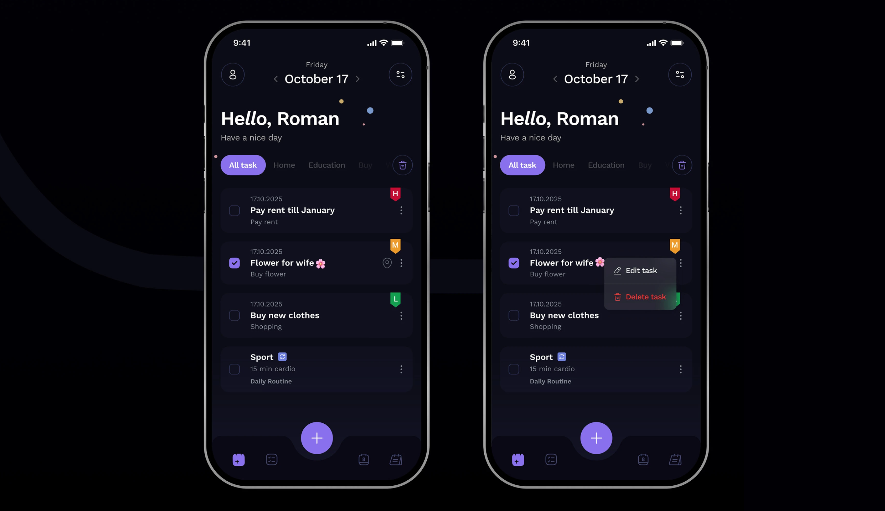
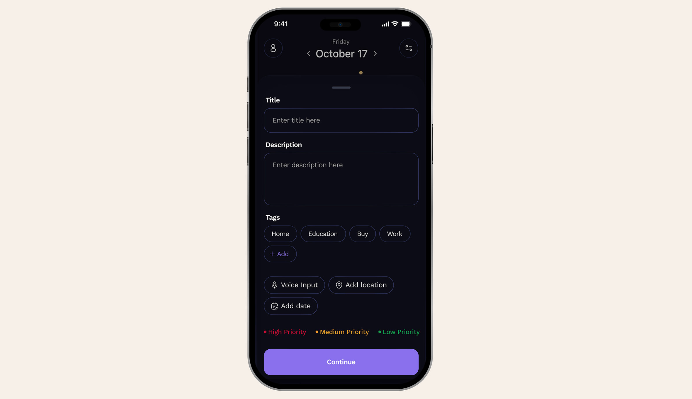
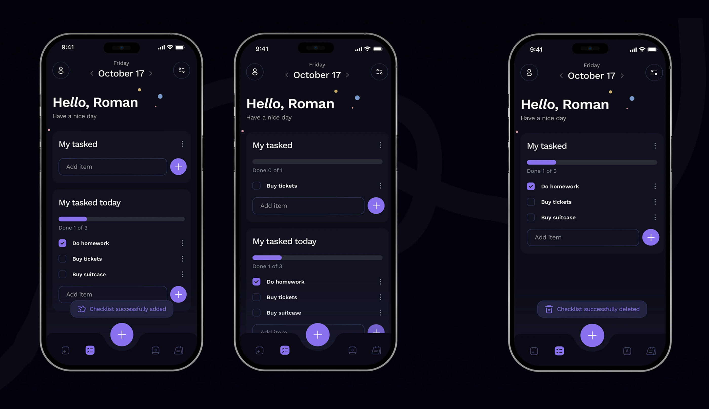

# Mivo Mobile App – Task Planner

  
*Вдохновлено [оригинальным кейсом на Behance](https://www.behance.net/gallery/223726215/Mivo-Mobile-app-Task-Planner)*

## 📌 О проекте
**Mivo** — это мобильное приложение для управления задачами, сочетающее в себе интуитивно понятный интерфейс и продуманный минималистичный дизайн. Проект вдохновлен исследованиями пользовательских привычек и современными трендами в продуктивности, предлагая не просто планировщик, а персонализированный инструмент для организации времени.
### 🔹 Основные функции:
- **Управление задачами** с категориями и тегами.
- **Гибкое расписание** с привязкой к времени и датам.
- **Визуальные статистики** для отслеживания продуктивности.
- **Персонализация** через выбор цветовых тем и иконок.

## 🎨 Экраны

### 1. Главный экран
  
- Список задач с приоритетами (цветные метки).
- Быстрый доступ к текущим и запланированным задачам.

### 2. Создание задачи
  
- Поля для названия, описания, категории и приоритет.

### 3. Статистика
  
- Графики выполненных задач за неделю/месяц.
- Анализ продуктивности по категориям.

___

### Mivo — это мобильное приложение для тех, кто ценит простоту и эффективность.  
### 📅 Чистое планирование
- Управляйте задачами без цифрового шума — только важное.
### 📊 Осознанная продуктивность  
- Анализируйте свою эффективность через наглядную статистику.
### 🎨 Персонализация  
- Настраивайте интерфейс под свой стиль и потребности.
> **Философия продукта**: Минимум действий — максимум результата.